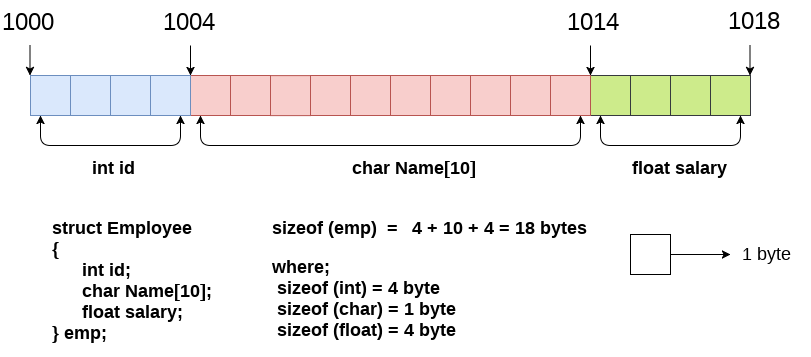
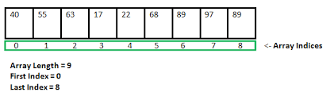
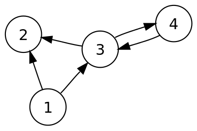

# Struktury danych oraz kolekcje w C#

Artykuł ten jest poświęcony strukturom danych, które znamy w współczesnej informatyce oraz gotowym kolekcjom w C#.

Dowiesz się miedzy innymi:

- Czym są struktury danych oraz w jaki sposób działają i jakie istnieją w informatyce
- Czym są kolekcje, ich implementacje i różnice
- Porównanie funkcjonalności
- Dodatkowe niestandardowe kolekcje

---

### Spis treści:

1. Struktury danych
   1. Struktura (rekord)
   2. krotka
   3. Tablica
   4. Lista (Linked list)
   5. Stos
   6. Kolejka
   7. Drzewo
   8. Graf
2. Co to są kolekcje?
   1. TODO
3. Dlaczego kolekcje dziedziczą po wielu interfejsach?
   1. TODO
4. Interfejs IEnumerable i IEnumerator
   1. TODO
5. Kolekcja generyczna i niegeneryczna
   1. TODO
6. Kolekcje niegeneryczne
   1. TODO
7. Kolekcje generyczne
   1. TODO
8. Thread-safe w kolekcjach
   1. TODO
9. Niestandardowe implementacje kolekcji w C#
   1. TODO
10. Własna kolekcja w C#
    1. TODO
11. Literatura

---

### 1. Struktury danych

Struktury danych to sposób **przechowywania naszych danych w pamięci komputera.** Danymi z pamięci komputera zarządzają algorytmy, które są zaimplementowane w kolekcjach, ale o tym w kolejnych rozdziałach.

Struktury danych wykorzystujemy do świadomego zarządzania naszymi danymi, aby przyśpieszyć lub zoptymalizować dostęp do naszych danych.

Wiele języków programowania posiada gotowe implementacje struktury danych już w swoich wbudowanych bibliotekach, np. w C# jest to **System.Collections.**

Jest 8 głównych strutkur danych, które są najpopularniejsze w programowaniu:

- struktura (rekord)
- krotka,
- tablica,
- lista,
- stos,
- kolejka,
- drzewo,
- graf

### 1.1 Struktura (rekord)

Struktura, inaczej zwana rekordem jest to grupa powiązana ze sobą danych różnego typu w jednym obszarze pamięci. Każda struktur składa się z pól do których ma się dostęp za pomocą unikatowych nazw. Podanie unikatowej nazwy daje nam dostęp do wskazanego pola.



Na zdjęciu powyżej przedstawione jest w jaki sposób alokowana jest pamięć struktury w pamięci RAM.

Struktura alokuje większa ilość pamięci dla niektórych struktur tworząc tzw. padding. Padding pomaga w lepszej pracy mikroprocesora.

Struktura w C# jest typem wartościowym, dlatego więc zarządzana jest na stosie tak jak inne typy wartościowe np. int.

Przykład w C#:

```csharp
    struct Point
    {
        private readonly int _x;
        private readonly int _y;

        public Point(int x, int y)
        {
            _x = x;
            _y = y;
        }

        public override string ToString()
        {
            return $"X: {_x}, Y: {_y}";
        }
    }

    static void Main(string[] args)
    {
        var point = new Point(1, 2);
        Console.WriteLine(point);
    }
```

### 1.2 Krotka

Krotka jest reprezentacją n-ki (para uporządkowana) w informatyce przedstawiająca uporzadkowane ciągi wartości. Typ ten przechowuje **stałe wartości** o różnych typach danych. Nie jest możliwa modyfikacja żadnego elementu, a odczyt wymaga podania indeksu liczbowego (zamiast nazwy jak występuje to w strukturach).

Typowa tupla jest typem wartościowym, jednak w C# jest i również typem referencyjnym. (ValueTuple jest typem wartościowym, a Tuple typem referencyjnym). Dlatego, że ValueTuple jest to tak naprawdę struktura, a Tuple to klasa.

Przykład Tuple oraz ValueTuple:

```csharp
    static void Main(string[] args)
    {
        var valueTuple = new ValueTuple<int,string>(1, "testowa wartosc");
        var valueTuple2 = (1, "testowa wartosc");
        Console.WriteLine($"{valueTuple.Item2} - {valueTuple.Item1}");
        Console.WriteLine($"{valueTuple2.Item2} - {valueTuple2.Item1}");

        var tuple = new Tuple<int, string>(1, "testowa wartosc");
        Console.WriteLine($"{tuple.Item2} - {tuple.Item1}");
    }
```

### 1.3 Tablica

Kontener (kontener to również struktura danych, lecz mocno zbliżona do właściwości tablicy) uporządkowanych danych, zazwyczaj tego samego typu dostępne za pomocą kluczu, czyli tzw. indeksu. Tablica może przechowywać inne tablice tworząc w ten sposób tablice wielowymiarowe. Tablice są statycznych rozmiarów, jeśli chcemy rozszerzyć naszą tablicę, wtedy tworzymy nową tablicę i przenosimy te dane do nowej, rozszerzając ją o dodatkowe miejsca. Tablica zajmuje tyle miejsca w pamięci ile jej wskazujemy przy inicjalizacji. Niewykorzystane miejsce jest ciągle zarezerwowane na przyszłość.

Przykład tablicy:



Tablica umożliwia szybki dostęp do danych za pomocą wskazania indeksu, w którym dana wartość się znajduję. Usuwanie elementów nie istnieje, lecz istnieje możliwość zastąpienia istniejącej wartości inną lub pustą. Jest to jedna z najszybszych i najprostszych struktur danych.

Przykład w C#

```csharp
    static void Main(string[] args)
    {
        var array = new int[3];
        array[0] = 1;
        array[1] = 2;
        array[2] = 3;
        Console.WriteLine(array[0] + array[1] + array[2]);
    }
```

### 1.4 Lista (Linked list)

Struktura danych, która posiada uporządkowane elementy w liniowym porządku. Każdy element posiada referencje do następnego elementu. Wymieniamy 2 główne listy, czyli jednokierunkowa lub dwukierunkowa. W jednokierunkowej poruszanie się po elementach występuje w jedną stronę, a w dwukierunkowej po obu stronach.

Przykład w C#

```csharp
    static void Main(string[] args)
    {
        var linkedList = new LinkedList<string>();
        linkedList.AddLast("first");
        linkedList.AddLast("second");
        linkedList.AddLast("third");
        Console.WriteLine(linkedList.First.Value);
        Console.WriteLine(linkedList.Last.Value);
        Console.WriteLine(linkedList.Find("second").Value);

        linkedList.RemoveFirst();
        Console.WriteLine(linkedList.First.Value);

        linkedList.AddBefore(linkedList.First, "new first");
        Console.WriteLine(linkedList.First.Value);
    }
```

### 1.5 Stos

Stos to również liniowa struktura, w której występuje tzw. LIFO (ostatni wchodzi pierwszy wychodzi). Tą strukturę danych można sobie porównać do sterty książek, za każdym razem dokładamy książki i czytamy tylko te, które są na wierzchu. Elementy na stosie można obejrzeć, jednak należy robić to pokolei od pierwszego elementu do ostatniego. Nie można wyciągać elementów ze środka stosu, należy ściągnać wszystkie te, które są nad danym elementem.

Stos jest popularny w informatyce m.in. w rejestrze procesora, do przechowywania zmiennych lokalnych w naszych programach.

W niektórych językach programowania tablica posiada funkcję stosu, czyli push, pop.

Przykład w C#

```csharp
    static void Main(string[] args)
    {
        var stos = new Stack<string>();

        stos.Push("1");
        stos.Push("2");
        stos.Push("3");

        foreach (var element in stos)
        {
            Console.WriteLine(element);
        }
    }
```

### 1.6 Kolejka

Struktura danych podobna do stosu, tylko wyznaje inną zasadę, czyli FIFO (Pierwszy wchodzi pierwszy wychodzi).
Kolejka jak sama nazwa mówi działa jak kolejka np. w sklepie. Specjalną modyfikacją kolejki może być kolejka priorytetowa, która narzuca priorytet swoim elementom (kolejka priorytetowa występuje w priorytecie procesów w procesorze).

Przykład w C#

```csharp
    static void Main(string[] args)
    {
        var stos = new Queue<string>();

        stos.Enqueue("1");
        stos.Enqueue("2");
        stos.Enqueue("3");

        foreach (var element in stos)
        {
            Console.WriteLine(element);
        }
    }
```

### 1.7 Drzewo

Struktura danych reprezentująca w naturalny sposób hierarchię danych. Drzewa ułatwiają i przyśpieszają pracę w wyszukiwaniach danych oraz pozwalają na łatwą pracę na posortowanych danych.
Drzewa są najpopularniejsze w informatyce i stosowane w m.in. bazach danych, serwerach, telekomunikacji itd.

Drzewo składa się z wierzchołka oraz krawędzi. Jeśli mamy więcej niż 1 wierzchołek to wyznaczamy jeden główny wierzchołek nazywając go korzeniem drzewa. Ciąg krawędzi nazywamy ścieżką. Główny wierzchołek jest rodzicem, a wierzchołki pod nim dziećmi.

Prostym drzewem jest drzewo binarne, które posiada tylko maksymalnie 2 dzieci.

Przykładem drzewa w C# może być LinkedList, która reprezentuje drzewo posiadające po jednym dziecku dla każdego rodzica.

Kopiec, inaczej zwany sterta również jest oparty na drzewie, znajdziemy go w m.in zarządzaniu pamięcią w C# za pomocą Garbage Collectora.

### 1.8 Graf

Graf podstawowy obiekt rozważań teorii grafów, struktura matematyczna przedstawiająca relacje pomiędzy obiektami. Grafy wykorzystywane są bardzo często, np. w systemach GPS, sztucznej inteligencji, trasowanie tras w telekomunikacji.

Wierzchołki w grafie mogą być numerowane, a krawędzie mogą posiadać wagi oraz wyznaczony kierunek.

Drzewo możemy nazwać grafem, dlatego że również posiada wierzchołki oraz krawędzie, które prowadzą Nas do jakiegoś wierzchołka.

Grafy są najbardziej rozbudowaną strukturą danych i najbardziej zaawansowaną.

Przykład grafu:


### 2 Co to są kolekcje?

### 11. Literatura

http://kurs.aspnetmvc.pl/Csharp/Tablice
http://kurs.aspnetmvc.pl/Csharp/Lancuchy
http://kurs.aspnetmvc.pl/Csharp/Kolekcje
http://kurs.aspnetmvc.pl/Csharp/Kolekcje_generyczne
http://kurs.aspnetmvc.pl/Csharp/Interfejsy_kolekcji_generycznych
http://kurs.aspnetmvc.pl/Csharp/Ienumerable_ienumerator
http://kurs.aspnetmvc.pl/Csharp/Iteratory_yield_return
https://www.plukasiewicz.net/Csharp_dla_zaawansowanych/Kolekcje

https://learn.microsoft.com/pl-pl/dotnet/standard/collections/

https://learn.microsoft.com/pl-pl/dotnet/standard/collections/selecting-a-collection-class

https://learn.microsoft.com/pl-pl/dotnet/csharp/language-reference/builtin-types/collections

https://learn.microsoft.com/pl-pl/dotnet/csharp/language-reference/builtin-types/arrays

https://learn.microsoft.com/pl-pl/dotnet/standard/collections/commonly-used-collection-types

https://learn.microsoft.com/pl-pl/dotnet/standard/collections/when-to-use-generic-collections

https://learn.microsoft.com/pl-pl/dotnet/standard/collections/comparisons-and-sorts-within-collections

https://learn.microsoft.com/pl-pl/dotnet/standard/collections/sorted-collection-types

https://learn.microsoft.com/pl-pl/dotnet/standard/collections/hashtable-and-dictionary-collection-types

https://learn.microsoft.com/pl-pl/dotnet/standard/collections/thread-safe/?toc=%2Fdotnet%2Ffundamentals%2Ftoc.json&bc=%2Fdotnet%2Fbreadcrumb%2Ftoc.json

https://learn.microsoft.com/pl-pl/dotnet/fundamentals/runtime-libraries/system-collections-generic-hashset%7Bt%7D

https://learn.microsoft.com/pl-pl/dotnet/fundamentals/runtime-libraries/system-collections-generic-list%7Bt%7D

https://learn.microsoft.com/pl-pl/dotnet/fundamentals/runtime-libraries/system-collections-objectmodel-observablecollection%7Bt%7D

https://pl.wikipedia.org/wiki/Struktura_danych

https://pl.wikipedia.org/wiki/Struktura_(programowanie)

https://pl.wikipedia.org/wiki/Krotka_(struktura_danych)

https://pl.wikipedia.org/wiki/Tablica_(informatyka)

https://pl.wikipedia.org/wiki/Lista

https://pl.wikipedia.org/wiki/Stos_(informatyka)

https://pl.wikipedia.org/wiki/Kolejka_(informatyka)

https://pl.wikipedia.org/wiki/Drzewo_(informatyka)

https://pl.wikipedia.org/wiki/Graf_(matematyka)

https://pl.wikipedia.org/wiki/Kopiec_(informatyka)

https://www.javatpoint.com/structure-in-c

https://www.geeksforgeeks.org/dynamic-memory-allocation-in-c-using-malloc-calloc-free-and-realloc/
